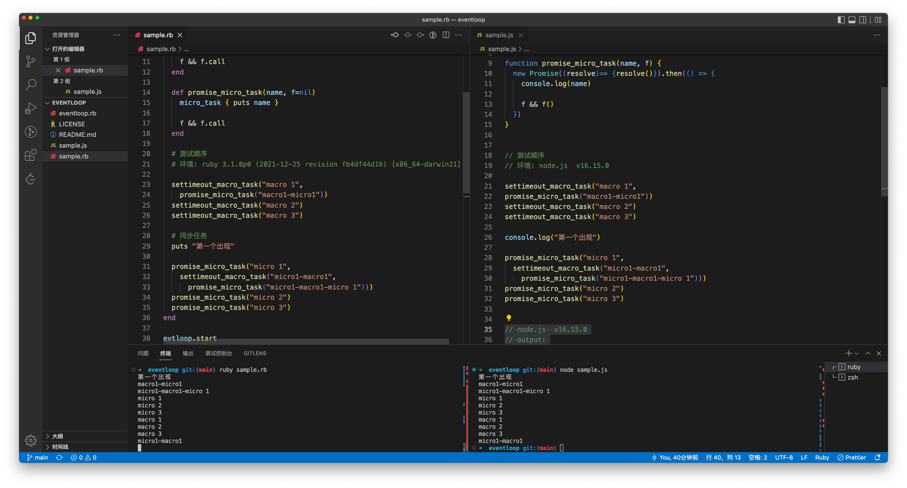

# Ruby code simulate Eventloop


## Run sample

use Ruby code simulate Eventloop

`ruby sample.rb`

`node sample.js`

compare the result 


## Simulate Features

simulate eventloop

* macro_task
* micro_task
* settimeout ( timer micro_task)
* promise (micro_task)

## Eventloop Model

```
（start)
   |
  init (e.g create TimerThread )
   |
  sync task (e.g read & run code) 
   |                                        
   |
 ------------------>
|                  |                                    -------------
|               macro_task  ---  add timer task -->    | TimerThread |
|   (Eventloop)    |       <--  insertjob result ---    -------------
|                  |
|               micro_task
|                  |
|                  |
 <-----------------   
   |
   |
  (end)

```

## Sample Result

